# Documentação de Diagramas — SGE Químico v2

**Data:** 02 de abril de 2026  
**Status:** Análise Detalhada + Especificação de Diagramas  
**Autor:** GitHub Copilot  

---

## 📋 Índice

1. [Análise Detalhada do Sistema Atual](#análise-detalhada-do-sistema-atual)
2. [Diagrama Entidade-Relacionamento (ER)](#diagrama-entidaderelacionamento-er)
3. [Diagramas de Caso de Uso](#diagramas-de-caso-de-uso)
4. [Diagramas de Sequência](#diagramas-de-sequência)
5. [Diagramas Adicionais Sugeridos](#diagramas-adicionais-sugeridos)
6. [Ferramentas Recomendadas](#ferramentas-recomendadas)
7. [Guia Prático: Como Criar Cada Diagrama](#guia-prático-como-criar-cada-diagrama)

---

## Análise Detalhada do Sistema Atual

### 🎯 Visão Geral

**SGE Químico v2** é um sistema de gerenciamento de ciclo de vida de contentores IBC (embalagens industriais de aço inoxidável) em ambiente químico.

- **Tipo de Sistema:** Aplicação Web Full-Stack (Next.js 15)
- **Ambiente:** Desktop + Mobile/Responsivo
- **Usuários:** 3 perfis (ADMIN, ANALISTA, OPERADOR)
- **Banco de Dados:** PostgreSQL com Drizzle ORM
- **Autenticação:** JWT (jose)

### 📊 Arquitetura Técnica

| Camada | Tecnologia |
|--------|------------|
| **Frontend** | Next.js 15 App Router, React 19, TailwindCSS, shadcn/ui |
| **Backend** | Next.js API Routes, TypeScript, Zod (validação) |
| **Banco** | PostgreSQL 14+, Drizzle ORM |
| **Autenticação** | JWT (jose), bcryptjs, cookies seguras |
| **Deploy** | Docker Compose, Vercel / Railway |
| **Testes** | Vitest |

### 🔑 Principais Fluxos e Funcionalidades

#### 1. **Gestão de Contentores**
- Criar, atualizar, visualizar contentores IBC
- Rastrear status do contentor (DISPONÍVEL, EM_LIMPEZA, EM_CICLO, MANUTENCAO, etc.)
- Registrar histórico de mudanças de status
- Marcar contentores que precisam limpeza

#### 2. **Sistema de Checklists Dinâmicos**
- **Templates Versionados:** Checklists podem ter múltiplas versões com fluxo de revisão/aprovação
- **Tipos:** RECEBIMENTO (inspeção de entrada) e EXPEDICAO (inspeção de saída)
- **Lógica de Status:** Motor que avalia respostas e determina status do contentor
- **Coleta por Chave:** Campos dinâmicos com chaves únicas (ex: `avarias`, `lacreRoto`)
- **Governança:** Revisões submetidas por OPERADOR/ANALISTA, aprovadas por ADMIN
- **Sem Autoaprovação:** Constraint `noAutoAprovacao` garante que quem cria revisão não a aprova

#### 3. **Gestão de Limpeza**
- Requisições de limpeza com prioridade (BAIXA, MEDIA, ALTA, URGENTE)
- Rastreamento do status (PENDENTE, EM_ANDAMENTO, CONCLUIDA, CANCELADA)
- Alocação de operador executor
- Origem da requisição (REQUISICAO_FORMAL, LIMPEZA_DIRETA)
- Reserva para produção

#### 4. **Sistema de Usuários e Permissões**
- 3 perfis: **ADMIN**, **ANALISTA**, **OPERADOR**
- Fluxo de aprovação de novos usuários
- Recuperação de senha com tokens temporários
- Sessões com expiração

#### 5. **Notificações e Histórico**
- Notificações por conteúdo e ações
- Histórico de eventos de templates (criação, edição, aprovação)
- Histórico de mudanças de status com rastreamento de usuário

### 🔄 Estado Atual: Implementação Parcial

| Funcionalidade | Status | Observação |
|----------------|--------|-----------|
| **CRUD Contentores** | ✅ Completo | Totalmente funcional |
| **Autenticação** | ✅ Completo | JWT, sessions, recuperação de senha |
| **Checklists Básicos** | ✅ Completo | Recebimento e expedição funcionando |
| **Templates Versionados** | ✅ Completo | Com revisão/aprovação, sem autoaprovação |
| **Motor de Status por Template** | 🟡 Parcial | Função `evaluateStatusFromTemplate` existe, mas rotas ainda usam lógica legada |
| **Drag-and-Drop Editor** | 🟡 Parcial | Editor CRUD existe, sem DnD visual |
| **Ordenação Explícita** | ❌ Não iniciado | Campo `order` ainda não adicionado a seções/campos |
| **Regras de Status Configuráveis** | 🟡 Parcial | Schema pronto, ainda não integrado nas rotas principais |
| **Gestão de Limpeza** | ✅ Completo | Requisições, prioridades, histórico |
| **Mobile Responsivo** | ✅ Completo | Renderização por chave, coleta de dados |

### 📦 Entidades Principais

#### **Usuários**
- `uuid` id
- `string` nome, email (único)
- `string` senhaHash
- `enum` perfil (ADMIN, ANALISTA, OPERADOR)
- `boolean` ativo (requer aprovação)
- Campos de aprovação/rejeição
- Tokens temporários para reset de senha

#### **Contentores**
- `uuid` id
- `string` numeroSerie (único, QR code)
- `enum` status (13 estados possíveis)
- `enum` tipoContentor (OFFSHORE, ONSHORE_REFIL, ONSHORE_BASE)
- Dados técnicos: tara, validade, última inspeção
- `boolean` precisaLimpeza
- Campos de manutenção externa

#### **Checklists Recebimento/Expedicao**
- Vínculo a contentor
- Vínculo a template e revisão específica
- Resposta dinâmica em JSONB
- Status resultante determinado por motor
- Dados do operador (nome, email, ID)
- Timestamps de inspeção

#### **Templates de Checklist**
- Versionamento obrigatório
- Múltiplas revisões com fluxo de aprovação
- Schema JSONB da definição (seções, campos)
- Tipo de checklist (RECEBIMENTO ou EXPEDICAO)
- Rastreamento de criador e aprovador

#### **Requisições de Limpeza**
- Vínculo a contentor
- Usuário solicitante e executor
- Status progression: PENDENTE → EM_ANDAMENTO → CONCLUIDA
- Prioridade matizada (BAIXA, MEDIA, ALTA, URGENTE)
- Timestamps: solicitação, início, conclusão

#### **Histórico**
- Status Histórico: rastreia TODAS as mudanças de status
- Eventos de Template: auditoria de criação/edição/aprovação
- Notificações: feed de alertas por usuário

### ⚡ Fluxos Críticos

#### **1. Fluxo de Recebimento de Contentor**
```
Contentor chega → Operador escaneia QR → 
Abre template de RECEBIMENTO → 
Preenche checklist (dinâmico) →
Motor avalia status via statusRules →
Contentor marcado com novo status →
Mensagem é notificada → Histórico registrado
```

#### **2. Fluxo de Expedição**
```
Operador solicita expedição →
Escaneia QR → Abre template EXPEDICAO →
Preenche dados de produto + destino →
Motor calcula status final →
Se OK, contentor marcado DISPONIVEL/CICLO →
Notificação e histórico
```

#### **3. Fluxo de Limpeza**
```
Requisição criada (PENDENTE) →
Admin aloca operador executor →
Executor marca EM_ANDAMENTO + data início →
Executor marca CONCLUIDA + observações →
Contentor volta a DISPONIVEL →
Histórico registrado
```

#### **4. Fluxo de Governança de Template**
```
Analista cria template novo →
Editor CRUD: seções + campos →
Salva como RASCUNHO →
(Futuro: Drag-drop para reordenação) →
Submete para aprovação (PENDENTE_APROVACAO) →
Admin revisa mudanças + aprova/rejeita (APROVADO ou REJEITADO) →
Se aprovado, passa a ser template ativo →
Próximas coletas usam versão aprovada
```

#### **5. Fluxo de Autenticação**
```
Novo usuário solicita acesso →
Usuário criado em INATIVO (requer aprovação) →
Email com senha temporária (expiração 24h) →
Admin aprova/rejeita no dashboard →
Se aprovado, usuário pode fazer login →
Força troca de senha na primeira entrada
```

---

## Diagrama Entidade-Relacionamento (ER)

### 📌 Cardinalidade e Relacionamentos

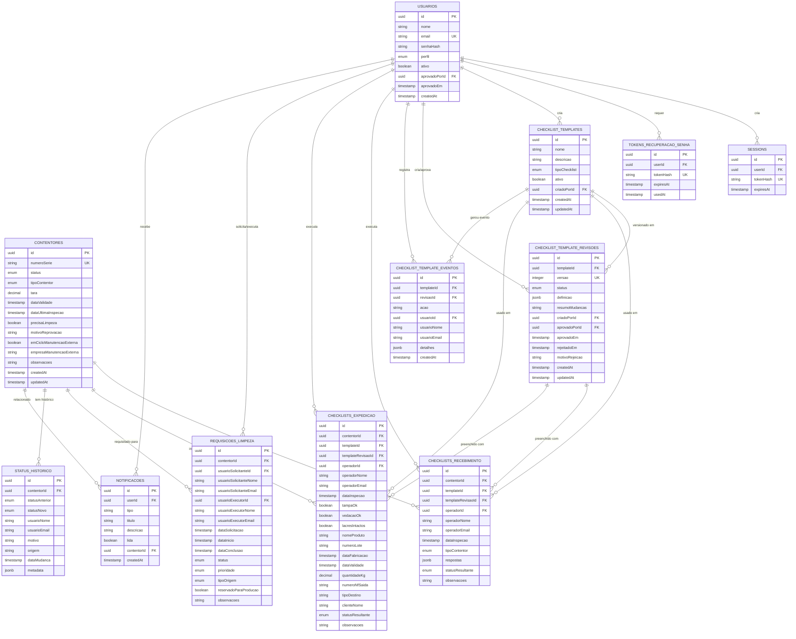

### 🔍 Especificação de Relacionamentos

| Relacionamento | Cardinalidade | Descrição |
|---|---|---|
| Usuário → Sessões | 1:N | Um usuário pode ter múltiplas sessões ativas |
| Usuário → Templates | 1:N | Um usuário cria múltiplos templates |
| Usuário → Revisões | 1:N | Usuário cria e aprova revisões |
| Usuário → Checklists | 1:N | Operador executa múltiplos checklists |
| Usuário → Requisições | 1:N | Solicitante e executor alocado |
| Template → Revisões | 1:N | Template tem múltiplas versões versionadas |
| Contentor → Checklists | 1:N | Contentor inspecionado várias vezes |
| Contentor → Limpezas | 1:N | Contentor requer múltiplas limpezas |
| Contentor → Histórico | 1:N | Histórico completo de status |
| Revisão → Checklists | 1:N | Uma revisão usada para múltiplas inspeções |

### 🔑 Constraints Notáveis

```sql
-- Sem autoaprovação de templates
ALTER TABLE checklist_template_revisoes
ADD CONSTRAINT noAutoAprovacao 
CHECK (aprovadoPorId IS NULL OR aprovadoPorId <> criadoPorId);

-- Unicidade de revisão por template + versão
CREATE UNIQUE INDEX checklist_template_revisoes_template_versao_unique
ON checklist_template_revisoes(templateId, versao);

-- Email único de usuários
ALTER TABLE usuarios ADD CONSTRAINT email_unique UNIQUE(email);

-- Série única de contentores
ALTER TABLE contentores ADD CONSTRAINT numero_serie_unique UNIQUE(numeroSerie);
```

---

## Diagramas de Caso de Uso

### 📌 Contexto Geral

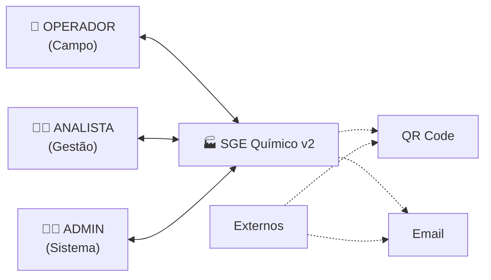

### 1️⃣ **Caso de Uso: Gestão de Contentores**

```mermaid
usecase diagram
    title Gerenciamento de Contentores
    
    system "SGE Químico - Contentores"
    
    actor OPERADOR
    actor ANALISTA
    actor ADMIN
    
    OPERADOR --> (LC1: Registrar Contentor Novo)
    OPERADOR --> (LC2: Consultar Status Contentor)
    OPERADOR --> (LC3: Marcar Contentor Necessita Limpeza)
    
    ANALISTA --> (LC2: Consultar Status Contentor)
    ANALISTA --> (LC4: Visualizar Relatório Contentores)
    ANALISTA --> (LC5: Atualizar Dados Técnicos)
    
    ADMIN --> (LC4: Visualizar Relatório Contentores)
    ADMIN --> (LC5: Atualizar Dados Técnicos)
    ADMIN --> (LC6: Deletar/Arquivar Contentor)
    
    (LC1: Registrar Contentor Novo) -.-> (Validar Série Única)
    (LC2: Consultar Status Contentor) -.-> (Consultar Histórico)
    (LC4: Visualizar Relatório Contentores) -.-> (Filtrar por Status)
    (LC5: Atualizar Dados Técnicos) -.-> (Registrar em Histórico)
```

### 2️⃣ **Caso de Uso: Checklists e Inspeção**

```mermaid
usecase diagram
    title Checklists - Recebimento e Expedição
    
    system "SGE Químico - Checklists"
    
    actor OPERADOR
    actor ANALISTA
    actor ADMIN
    
    OPERADOR --> (CK1: Escanear QR Contentor)
    OPERADOR --> (CK2: Preencher Checklist Recebimento)
    OPERADOR --> (CK3: Preencher Checklist Expedição)
    OPERADOR --> (CK4: Visualizar Template)
    
    ANALISTA --> (CK5: Criar Template Checklist)
    ANALISTA --> (CK6: Editar Template (Seções/Campos))
    ANALISTA --> (CK7: Submeter Template para Aprovação)
    ANALISTA --> (CK4: Visualizar Template)
    
    ADMIN --> (CK8: Revisar e Aprovar Template)
    ADMIN --> (CK9: Rechazar Template com Justificativa)
    ADMIN --> (CK10: Ativar/Desativar Template)
    
    (CK1: Escanear QR Contentor) -.-> (Decodificar Série)
    (CK2: Preencher Checklist Recebimento) -.-> (Motor Avalia Status)
    (CK3: Preencher Checklist Expedição) -.-> (Motor Avalia Status)
    (CK6: Editar Template) -.-> (Salvar como RASCUNHO)
    (CK7: Submeter Template) -.-> (PENDENTE_APROVACAO)
    (CK8: Revisar Template) -.-> (Comparar Versões)
```

### 3️⃣ **Caso de Uso: Requisições de Limpeza**

```mermaid
usecase diagram
    title Gestão de Limpeza
    
    system "SGE Químico - Limpeza"
    
    actor OPERADOR
    actor ANALISTA
    actor ADMIN
    
    OPERADOR --> (LMP1: Marcar Contentor para Limpeza)
    OPERADOR --> (LMP2: Iniciar Limpeza)
    OPERADOR --> (LMP3: Finalizar Limpeza)
    OPERADOR --> (LMP4: Consultar Requisições Atribuídas)
    
    ANALISTA --> (LMP5: Criar Requisição Formal)
    ANALISTA --> (LMP6: Visualizar Todas Requisições)
    ANALISTA --> (LMP7: Alocação Operador Executor)
    
    ADMIN --> (LMP6: Visualizar Todas Requisições)
    ADMIN --> (LMP7: Alocação Operador Executor)
    ADMIN --> (LMP8: Definir Prioridades)
    
    (LMP1: Marcar Contentor) -.-> (Cria Requisição)
    (LMP2: Iniciar Limpeza) -.-> (Atualiza Status EM_ANDAMENTO)
    (LMP3: Finalizar) -.-> (Status CONCLUIDA + Histórico)
    (LMP7: Alocação) -.-> (Notifica Operador)
    (LMP8: Prioridades) -.-> (BAIXA, MÉDIA, ALTA, URGENTE)
```

### 4️⃣ **Caso de Uso: Autenticação e Usuários**

```mermaid
usecase diagram
    title Sistema de Autenticação e Permissões
    
    system "SGE Químico - Autenticação"
    
    actor "Novo Usuário"
    actor ADMIN
    actor "Usuário Autenticado"
    
    "Novo Usuário" --> (USR1: Solicitar Acesso)
    ADMIN --> (USR2: Revisar Solicitação)
    ADMIN --> (USR3: Aprovar/Rejeitar Usuário)
    ADMIN --> (USR4: Gerenciar Perfis)
    
    "Usuário Autenticado" --> (USR5: Fazer Login)
    "Usuário Autenticado" --> (USR6: Trocar Senha)
    "Usuário Autenticado" --> (USR7: Recuperar Senha)
    "Usuário Autenticado" --> (USR8: Fazer Logout)
    
    (USR1: Solicitar Acesso) -.-> (Email + Status INATIVO)
    (USR3: Aprovar) -.-> (Senha Temporária Enviada)
    (USR5: Login) -.-> (Valida JWT)
    (USR6: Trocar Senha) -.-> (Hash bcrypt)
    (USR7: Recuperar) -.-> (Token Temporário)
```

---

## Diagramas de Sequência

### 1️⃣ **Fluxo: Inspeção de Recebimento**

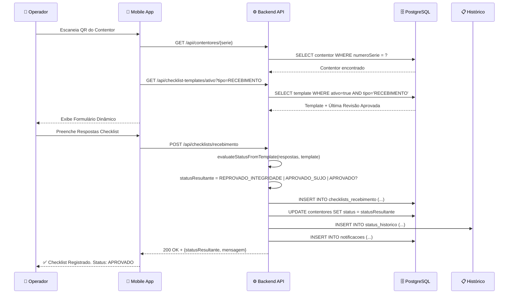

### 2️⃣ **Fluxo: Criação e Aprovação de Template**

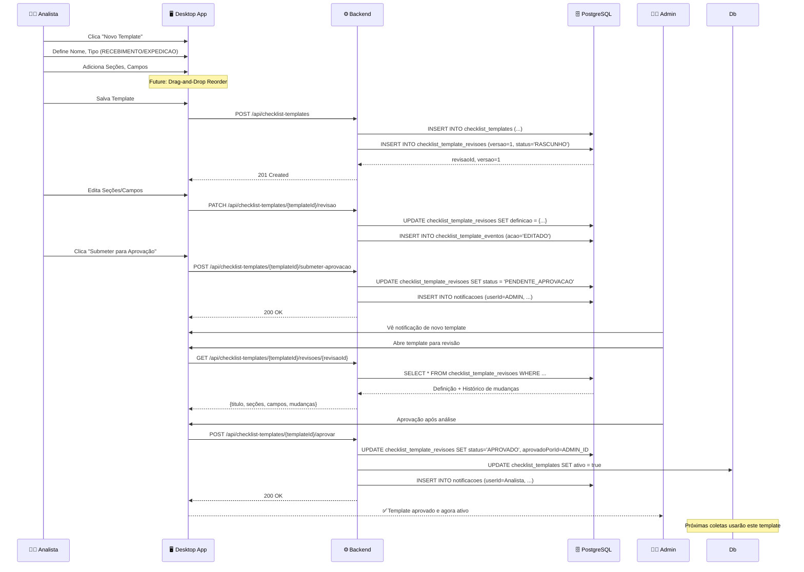

### 3️⃣ **Fluxo: Requisição e Execução de Limpeza**

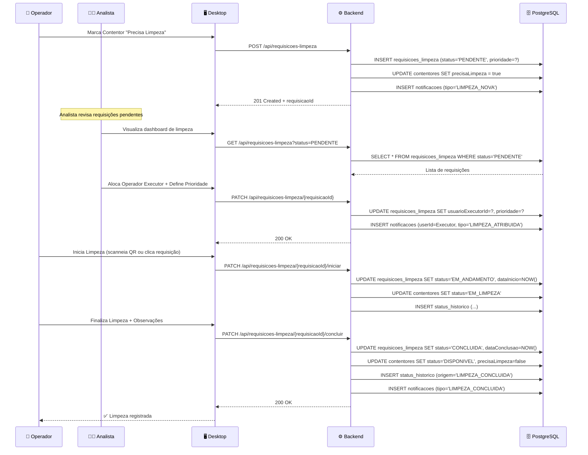

### 4️⃣ **Fluxo: Autenticação e Ciclo de Permissões**

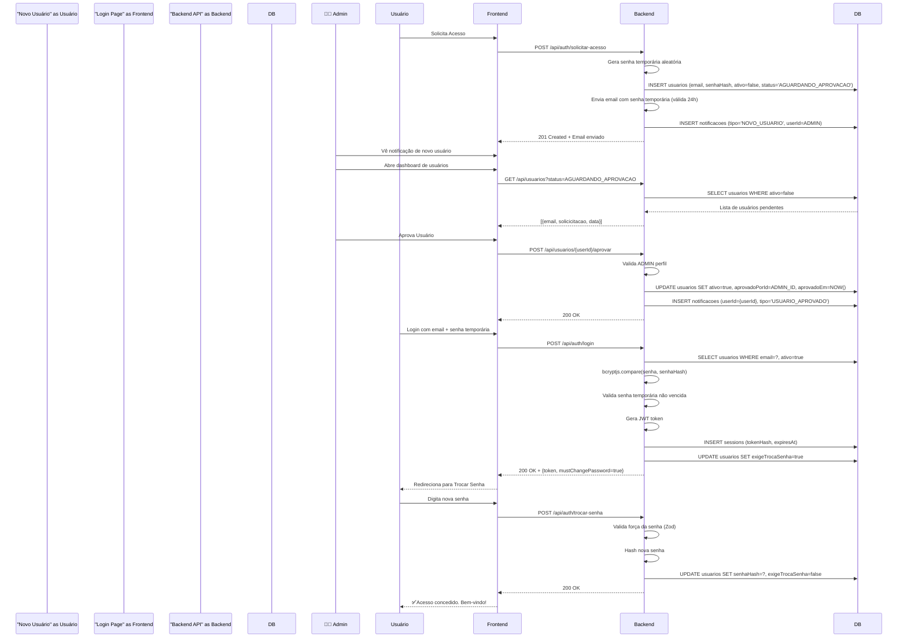

### 5️⃣ **Fluxo: Expedição de Contentor**

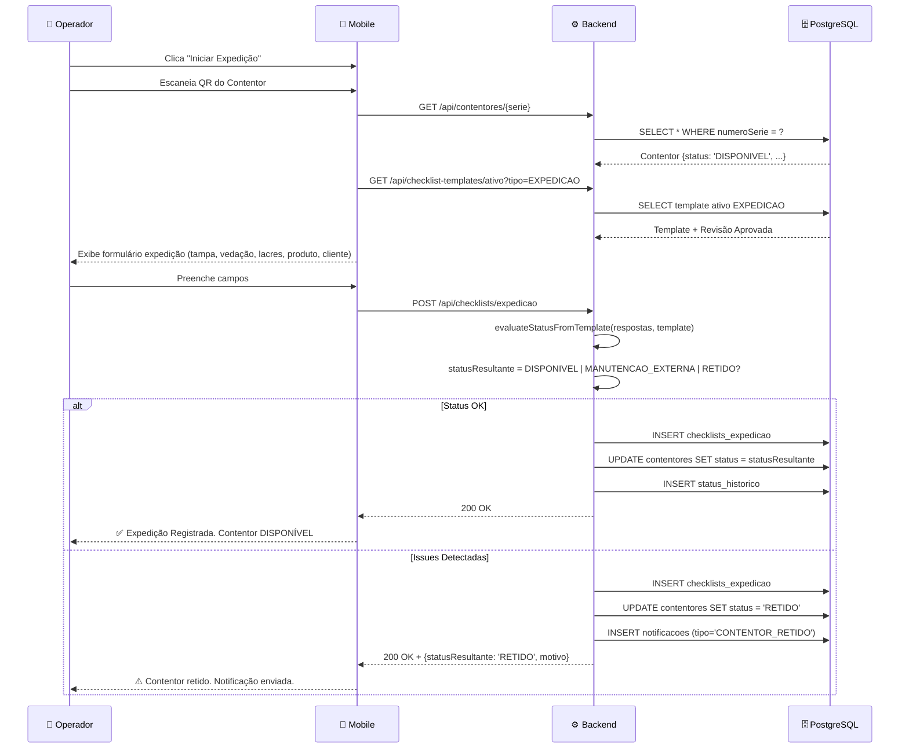

---

## Diagramas Adicionais Sugeridos

### 1️⃣ **Diagrama de Estados do Contentor**

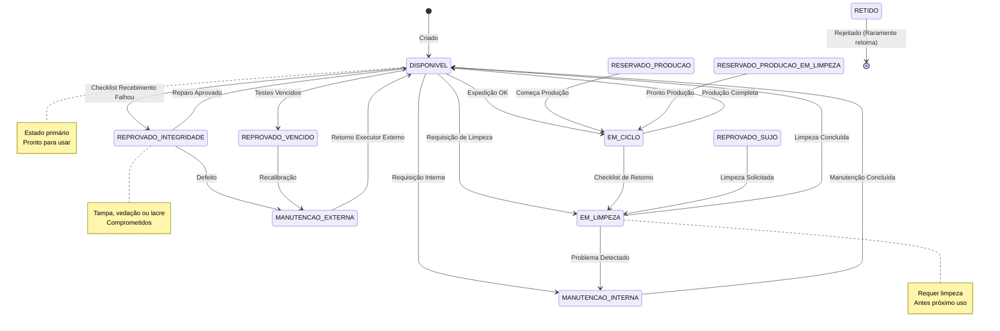

### 2️⃣ **Diagrama de Componentes Frontend**

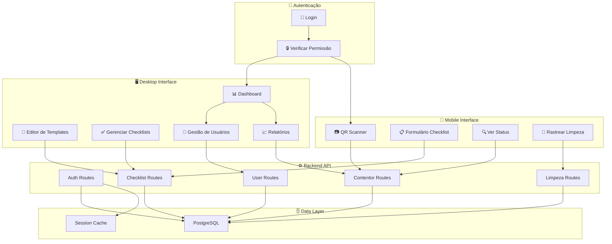

### 3️⃣ **Diagrama de Fluxo de Dados (DFD)**

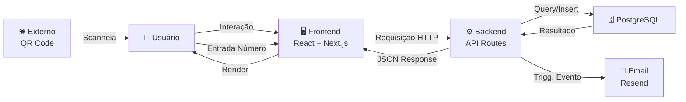

### 4️⃣ **Diagrama de Arquitetura em Camadas**

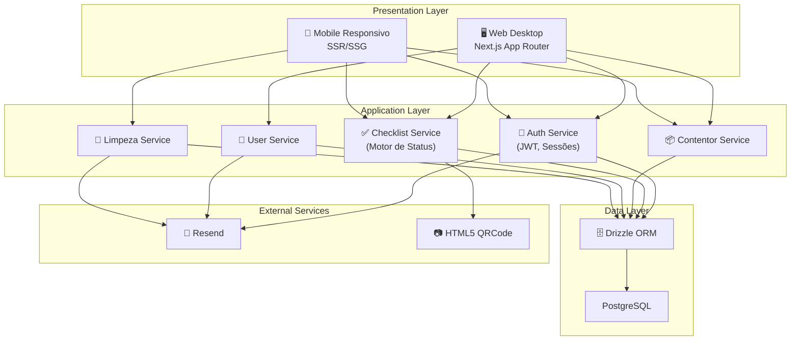

### 5️⃣ **Diagrama de Governança de Templates**

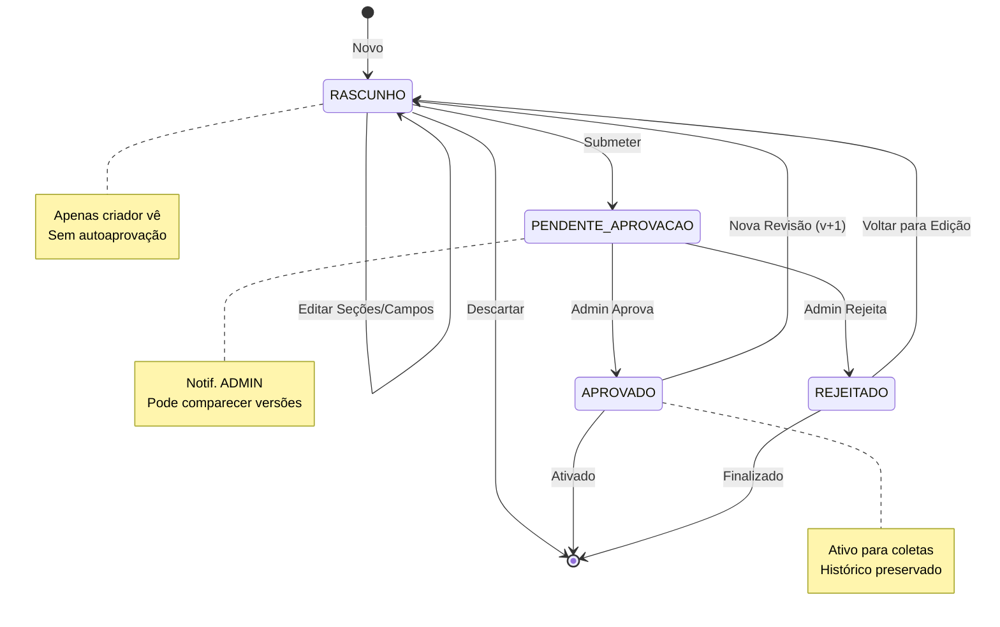

### 6️⃣ **Matriz de Permissões por Perfil**

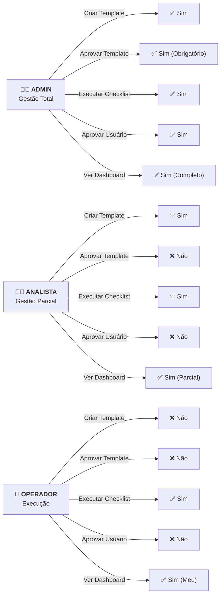

---

## Ferramentas Recomendadas

### 📊 Comparação de Ferramentas

| Ferramenta | Tipo | Vantagens | Desvantagens | Melhor Para |
|---|---|---|---|---|
| **Mermaid** | Texto/Markdown | Integrado ao VS Code, Git-friendly, Versionável | Menos visual, layout às vezes confuso | ✅ Este projeto |
| **Draw.io** | Visual/Web | Muito visual, drag-drop, export múltiplos formatos | Cloud-based, pode exigir login | ER e fluxos complexos |
| **Lucidchart** | Visual/Web | Professional, templates, colaborativo | Pago, exigir conta | Apresentações executivas |
| **Creately** | Visual/Web | Intuitivo, templates, integração Jira | Pago, menos poderoso | Brainstorm rápido |
| **PlantUML** | Texto | Git-friendly, código limpo | Curva de aprendizado | Diagramas UML formais |
| **Excalidraw** | Visual/Web | Estilo sketch, open-source, rápido | Menos formal | Design e ideação |

### 🎯 Recomendação para Este Projeto

**Mermaid (Texto) + Draw.io (Visual)**

1. **Mermaid** para:
   - ER (cardinality, relacionamentos)
   - Fluxos de estado (stateDiagram)
   - Sequência (interações)
   - Casos de uso (maior clareza)
   - Mantém tudo versionado no Git

2. **Draw.io** para:
   - Arquitetura detalhada (em camadas, componentes)
   - Diagramas de integração (visual premium)
   - Exportar para imagem (apresentações)
   - Colaboração em tempo real

### ▶️ Como Usar Mermaid no VS Code

1. **Instalar extensão:**
   ```bash
   code --install-extension Markdown Preview Mermaid Support
   ```

2. **Criar diagrama em .md:**
   ````markdown
   ```mermaid
   graph LR
       A --> B
   ```
   ````

3. **Previsuallizar:**
   - <kbd>Ctrl+Shift+V</kbd> (ou <kbd>Cmd+Shift+V</kbd> no Mac)

### ▶️ Como Usar Draw.io

1. **Acesso online:** https://draw.io (gratuito)
2. **VS Code:** Extensão "Draw.io Integration"
3. **Colaborativo:** Google Drive, OneDrive (salvar integrado)
4. **Export:** PNG, PDF, SVG para documentação

---

## Guia Prático: Como Criar Cada Diagrama

### 📌 1. Diagrama Entidade-Relacionamento (ER)

#### **Objetivo**
Mostrar todas as tabelas, colunas, tipos de dados, e como se relacionam.

#### **Passo a Passo (Mermaid)**

```markdown
1. Listar todas as entidades (tabelas)
2. Para cada uma, adicionar: PK (chave primária), FK (estrangeira), tipos
3. Adicionar relacionamentos com cardinalidade (1:N, N:N, etc.)
4. Usar notação ER padrão: || (1) -- o{ (N)

Exemplo:
USUARIOS ||--o{ SESSIONS : "cria"
```

#### **Verificação**
- [ ] Todas as tabelas estão presentes?
- [ ] PKs e FKs estão marcados?
- [ ] Cardinalidades fazem sentido (1 usuário → N sessões)?
- [ ] Constraints importantes estão documentados?

---

### 📌 2. Diagrama de Caso de Uso

#### **Objetivo**
Mostrar atores (usuários), casos de uso (ações), e extensões/inclusões.

#### **Passo a Passo (Mermaid)**

```markdown
1. Identificar ATORES (ADMIN, ANALISTA, OPERADOR)
2. Identificar CASOS DE USO por ator (criar template, executar checklist)
3. Usar setas para ligações:
   - ator --> (caso de uso)
4. Adicionar extensões com (..) -.-> (caso base)
5. Agrupar em subgrafos se necessário

Exemplo:
OPERADOR --> (CK1: Escanear QR)
ANALISTA --> (CK5: Criar Template)
(CK1: Escanear) -.-> (Validar Série)
```

#### **Verificação**
- [ ] Todos os 3 atores principais estão?
- [ ] Casos de uso descrevem "verbo + substantivo"?
- [ ] Extensões/inclusões estão nítidas?
- [ ] Não há casos de uso apenas de sistema (sem ator)?

---

### 📌 3. Diagrama de Sequência

#### **Objetivo**
Mostrar fluxo timeline de um processo (ex: checklist de recebimento).

#### **Passo a Passo (Mermaid)**

```markdown
1. Identificar ATORES e SISTEMAS no início (participant)
2. Seqüência de mensagens:
   - Ator ->> Sistema: Ação (seta grossa = síncronimo)
   - Sistema -->> Ator: Resposta (pontilhado = assíncrono)
   - Sistema ->> DB: Query (interno)
3. Adicionar notas com 'Note over participante: texto'
4. Adicionar alternativas com 'alt ... else ... end'
5. Loops com 'loop ... end'

Exemplo:
Operador ->> Mobile: Escaneia QR
Mobile ->> Backend: GET /api/contentores/{serie}
Backend ->> DB: SELECT * WHERE numeroSerie = ?
DB -->> Backend: Resultado
Backend -->> Mobile: 200 OK + {conteúdo}
```

#### **Verificação**
- [ ] Ordem temporal faz sentido (causa → efeito)?
- [ ] Todos os passos técnicos estão (API, BD)?
- [ ] Respostas OK e erros estão cobertos (alt/else)?
- [ ] Nomes de endpoints são realistas?

---

### 📌 4. Diagrama de Estados

#### **Objetivo**
Mostrar todos os possíveis estados de uma entidade e transições.

#### **Passo a Passo (Mermaid)**

```markdown
1. Identificar TODOS os estados (ex: 13 status do contentor)
2. Definir TRANSIÇÕES válidas:
   - DISPONIVEL --> EM_LIMPEZA (requisição)
   - EM_LIMPEZA --> DISPONIVEL (conclusão)
3. Marcar entrada [*] e saída final [*]
4. Colocar condições de transição se relevante
5. Adicionar notas explicativas

Exemplo:
[*] --> DISPONIVEL
DISPONIVEL --> EM_LIMPEZA: Requisição
EM_LIMPEZA --> DISPONIVEL: Conclusão
DISPONIVEL --> [*]
note right of EM_LIMPEZA
    Estado transitório
end note
```

#### **Verificação**
- [ ] Todos os estados estão presentes?
- [ ] Transições não permitidas estão ausentes?
- [ ] Estado inicial e final estão nítidos?
- [ ] Campos de negócio (datas, responsáveis) estão mapeados?

---

### 📌 5. Diagrama de Arquitetura (Camadas)

#### **Objetivo**
Mostrar estrutura de software em lógica de camadas.

#### **Passo a Passo (Draw.io ou Mermaid graph)**

```markdown
1. Camada PRESENTATION (UI, Frontend)
2. Camada APPLICATION (Serviços, Lógica)
3. Camada DATA (Banco, ORM)
4. Camada EXTERNAL (APIs externas, email)

5. Desenhar fluxo top-down:
   Presentation --> Application --> Data
   Application -.-> External

Exemplo:
subgraph "Presentation Layer"
    Web["🖥️ Web Desktop"]
    Mobile["📱 Mobile"]
end
subgraph "Application Layer"
    AuthService["Auth"]
end
subgraph "Data Layer"
    PostgreSQL["PostgreSQL"]
end

Web --> AuthService
AuthService --> PostgreSQL
```

#### **Verificação**
- [ ] Cada camada tem uma responsabilidade nítida?
- [ ] Dependências fluem de cima para baixo (não ao contrário)?
- [ ] Serviços externos estão isolados?
- [ ] Camadas de integração estão claras?

---

### 📌 6. Matriz de Permissões

#### **Objetivo**
Documentar quem pode fazer o quê (RBAC — Role-Based Access Control).

#### **Passo a Passo**

```markdown
| Ação | ADMIN | ANALISTA | OPERADOR |
|---|---|---|---|
| Criar Template | ✅ | ✅ | ❌ |
| Aprovar Template | ✅ | ❌ | ❌ |
| Executar Checklist | ✅ | ✅ | ✅ |
| Aprovar Usuário | ✅ | ❌ | ❌ |

OU em Mermaid (graph):
ADMIN -->|Pode| AproverTemplate
ANALISTA -->|Pode| CriarTemplate
OPERADOR -->|Pode| ExecutarChecklist
```

#### **Verificação**
- [ ] Cada perfil tem pelo menos uma ação exclusiva?
- [ ] Não há escalação de permissão (OPERADOR não aprova)?
- [ ] Hierarquia faz sentido (ADMIN ⊇ ANALISTA ⊇ OPERADOR)?

---

### 📌 7. Fluxograma de Processo

#### **Objetivo**
Mostrar fluxo passo-a-passo de um processo (não timeline, mas lógica condicional).

#### **Passo a Passo (Mermaid flowchart)**

```markdown
flowchart TD
    Start([Início])
    Condição{Checklist OK?}
    Sucesso["✅ Status = APROVADO"]
    Falha["❌ Status = REPROVADO"]
    Fim([Fim])
    
    Start --> Condição
    Condição -->|Sim| Sucesso
    Condição -->|Não| Falha
    Sucesso --> Fim
    Falha --> Fim

Notação:
- ([Start/End]) = Óvalo
- [Processo] = Retângulo
- {Decisão} = Losango
- --> = Fluxo
```

#### **Verificação**
- [ ] Cada decisão tem pelo menos 2 caminhos?
- [ ] Há um fim definido?
- [ ] Loops ou iterações estão marcados?
- [ ] Nenhama seta cruza sem necessidade (reorganizar)?

---

### 📌 Dicas de Manutenção

1. **Atualize diagramas ao adicionar entidades.**
   ```bash
   # Após adicionar tabela nova
   git add DIAGRAMAS_E_DOCUMENTACAO_SISTEMA.md
   git commit -m "docs: adiciona entidade Foo ao diagrama ER"
   ```

2. **Versione com o código.**
   ```markdown
   # Este arquivo está no repo e versionado
   src/drizzle/schema.ts → DIAGRAMAS_E_DOCUMENTACAO_SISTEMA.md
   ```

3. **Revisite periodicamente.**
   - A cada sprint ou milestone, valide fluxos contra implementação.

---

## 📝 Checklist de Completude

Antes de finalizar a documentação do seu projeto:

- [ ] **ER Diagrama:** Todas as 11 tabelas presentes?
- [ ] **Casos de Uso:** 3 atores, >5 cenários por ator?
- [ ] **Sequência:** 5 fluxos críticos documentados?
- [ ] **Estados:** Transições válidas e inválidas claras?
- [ ] **Arquitetura:** Camadas e dependencies nítidas?
- [ ] **Permissões:** Matriz RBAC completa?
- [ ] **Glossário:** Termos-chave definidos?

---

## 🎓 Referências e Recursos

### Padrões UML
- **OMG UML Standard:** https://www.omg.org/
- **Lucidchart Symbols:** https://www.lucidchart.com/pages/uml-symbols

### Ferramentas
- **Mermaid Docs:** https://mermaid.js.org/
- **Draw.io Docs:** https://www.drawio.com/
- **PlantUML Guide:** https://plantuml.com/

### Exemplos
- **Mermaid Examples:** https://github.com/mermaid-js/mermaid/tree/develop/demos
- **Real-world ER:** PostgreSQL documentation

---

## 📞 Próximos Passos

1. **Incorporar ferramentas sugeridas:**
   - [ ] Instale extensão Mermaid no VS Code
   - [ ] Crie conta no Draw.io (ou use localmente)

2. **Refinar diagramas:**
   - [ ] Valide cada diagrama contra código atual
   - [ ] Preencha lacunas identificadas

3. **Documentar decisões:**
   - [ ] ADR (Architecture Decision Records) para escolhas principais
   - [ ] Padrões de design (ex: padrão de status, governança)

4. **Manter vivo:**
   - [ ] Revise a cada feature nova
   - [ ] Distribua com equipe (Confluence, GitHub Wiki)

---

**Gerado em:** 2 de abril de 2026  
**Versão:** 1.0  
**Status:** Pronto para Uso  

